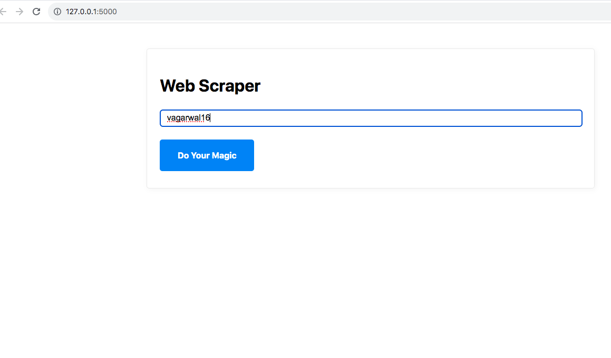

# LinkedIn Lookup & Icebreaker Generator

This project takes a **person’s name** as input, finds their **LinkedIn profile**, scrapes key information using the **Scrapin.io API**, and then generates a short summary, fun facts, interests, and creative icebreakers — all automatically!

---

## Screenshots

| Input Form | Generated Output |
|-------------|------------------|
|  |  |

---

## ✨ Features

-  Finds LinkedIn profiles that match a given name using a lookup agent  
-  Integrates with **Scrapin.io API** for LinkedIn data extraction  
-  Generates:
  - A concise professional summary  
  - 2 interesting facts about the user  
  - 3 potential topics of interest  
  - 2 creative icebreakers for conversation  
- ⚡ Fast and modular — easily extensible for personalization

---

## 🧰 Tech Stack

**Frontend**
- HTML5 — simple interface for user input and results display  

**Backend**
- Python Flask — lightweight web framework to handle routes, requests, and responses  

**Data Extraction**
- Scrapin.io API — extracts structured LinkedIn profile data based on profile URLs  

**AI / Agents**
- LangChain — orchestration framework for managing LLM-based workflows  
- LangGraph — for building and visualizing composable AI agents and pipelines  
- ChatOpenAI — OpenAI chat model integration for generating summaries, facts, and icebreakers  
- PromptTemplate — to structure and control prompts sent to the LLM  
- PydanticOutputParser — ensures generated responses follow a defined schema  
- RunnableSequence — for chaining multiple AI and data-processing steps  
- TavilySearch & get_profile_url_tavily — for performing intelligent web searches and LinkedIn profile discovery  

**Utilities**
- Python 3.10+ — core programming language  
- dotenv — for managing API keys and environment variables  

**APIs / Keys**
- Scrapin.io API key (for LinkedIn scraping)  
- OpenAI API key (for AI text generation)  
- Tavily API key (for profile and web search)


---

## ⚙️ Installation & Setup

### 1. Clone the Repository
```bash
git clone https://github.com/yourusername/linkedin-lookup-icebreaker.git
cd linkedin-lookup-icebreaker
